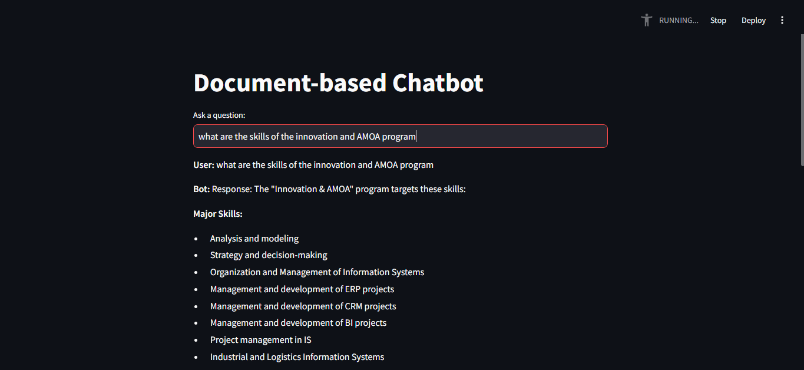

# Document-based RAG Chatbot 🤖

[](https://www.python.org/downloads/release/python-3100/)
[](https://www.docker.com/)
[](https://streamlit.io/)

A powerful document-based chatbot using RAG (Retrieval-Augmented Generation) architecture. Query your documents through a user-friendly interface powered by local LLMs.

## 🌟 Features

- 💬 Interactive chat interface with Streamlit
- 📚 Document embedding and semantic search with ChromaDB
- 🤖 Local LLM (gemma2) integration using Ollama
- 🐳 Docker containerized deployment
- ⚡ Asynchronous processing
- 📄 Support for document ingestion and processing

## 🚀 Quick Start

### Using Docker (Recommended)

1. Clone the repository:
   ```bash
   git clone https://github.com/ajmalmehdi/Document-Assistant-Using-RAG
2. Start the application
    ```bash
    docker-compose -f docker_compose.yml up --build -d
### Local Installation

1. Install dependencies
   you need to have ollama running in your local machine
    ```bash
    ollama pull gemma2
    ollama pull mxbai-embed-large
    ollama serve

2. run the app locally
    ```bash
    cd rag_app
    streamlit run app.py

### 📄 Changing the document
the document used is a text file containing informations about my school (INPT)
to change the document nafigate to:

     rag_app/data/data.txt
then run the script to load the text file and create the embeddings

    cd rag_app
    python -m scripts.load_data --reset
### 📸 Application Preview



  
